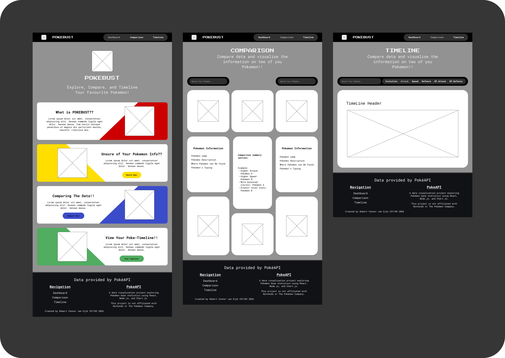
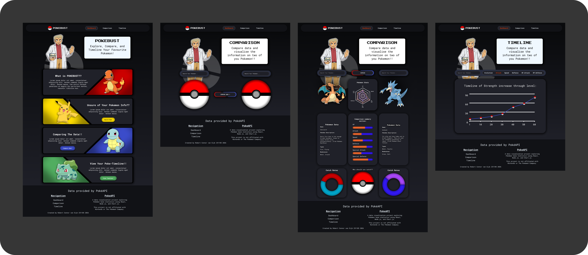

# MyPokemonWebApp


# About Pokebust
Pokébust is a React-based web application that allows Pokémon fans and trainers to explore, compare, and analyse their favourite Pokémon using live data from the PokéAPI. The app features two core pages: a Comparison page where two Pokémon can be searched and compared head-to-head across multiple data visualisations, and a Timeline page where a single Pokémon's stat growth can be tracked across all 100 levels. Built with a focus on interactivity and data visualisation, Pokébust brings Pokémon stats to life in a way that goes beyond the standard Pokédex.

### Built With
[](https://www.javascript.com/)
[](https://nodejs.org/en)
[](https://react.dev/)
[](https://www.chartjs.org/)
[](https://getbootstrap.com/)


## How To Install

To get started, clone the repo:
```
git clone https://github.com/RobertvanEijk-OW-251185/MyPokemonWebApp.git
```

Change Directory:
```
cd pokebust
```

Install all the dependencies using npm:
```
npm install
```

Run the app:
```
npm start
```

## Features

| Home Page | Compare Page | Timeline Page |
| :--- | :--- | :--- |
| Basic Explanation of Pokébust | Search for two Pokémon | Search for a specific Pokémon |
| Basic Explanation of Comparison Page | Compare the searched Pokémon's base stats | View searched Pokémons stat growth over time |
| Basic Explanation of Timeline Page | Base Stats on Radar Chart and Bar charts |  |
|  | View catch rates of searched Pokémon on Doughnut Charts |  |

## The Idea
The idea behind Pokébust came from a desire to build something that combined a genuine personal interest with real-world front-end development skills. Pokémon offers a rich, well-documented API, making it an ideal data source for a project focused on data fetching, state management, and dynamic charting. The goal was to create a tool that would truly be useful to Pokémon players—helping them make informed decisions about which Pokémon to use, train, or catch—while also serving as a strong showcase of React development skills.

## Wireframes



## Development Process
Pokébust was built entirely in React.js, using Chart.js via react-chartjs-2 for all data visualisations and the PokéAPI as the sole data source. The development process followed a component-driven approach, with each feature broken down into logical groups before implementation, covering search functionality, API integration, and chart rendering as separate concerns before wiring them together.

### Highlights
A highlight of the process was building out the stat comparison system, particularly the versus scoring formula that normalises each Pokémon's base stats into an overall percentage score, allowing for a clear and fair head-to-head comparison. Implementing the Timeline page's level-based stat growth chart using the official Pokémon stat formula was another satisfying milestone, as it required combining API data with front-end calculations to produce meaningful visualisations.

### Challenges
The most significant challenge was managing state across multiple components, particularly on the Comparison page, where two Pokémon's data needed to flow through several charts and data boxes simultaneously. Getting the prop flow right between PokeGrid and its child chart components, and ensuring that all visualisations are updated correctly on each new search, required careful planning and several iterations.

## Possible Future Implementations
Several features could meaningfully extend Pokébust in the future. A search autocomplete feature would improve the user experience by suggesting Pokémon names as users type, reducing failed searches. The Timeline page could be expanded to allow multiple Pokémon to be plotted on the same chart simultaneously, making it easier to compare stat growth curves side by side. The Comparison page could be enhanced with move set data, showing which moves each Pokémon can learn and highlighting type advantages between the two. A favourites or history system using local storage would allow users to save and revisit previous comparisons without having to re-search. Finally, adding full evolution chain visualisations would give users a broader picture of a Pokémon's potential beyond its base form.

## Mockups


## Demonstration
[Demonstration Video Link](https://drive.google.com/file/d/1WP9TQFs7ELAa9zHKjnk8U71kr_NTAkBi/view?usp=drive_link)
[Demonstration Video Drive Folder Link](https://drive.google.com/drive/folders/1cF_54dCV9SnFikIzln_Xk8jHIQJKeldN?usp=drive_link)

## Not sure where to start?
Try searching for any of the following Pokémon: Pikachu, Charizard, Mewtwo, Mew, Dragonite, Eevee, Magikarp, or Metagross.
